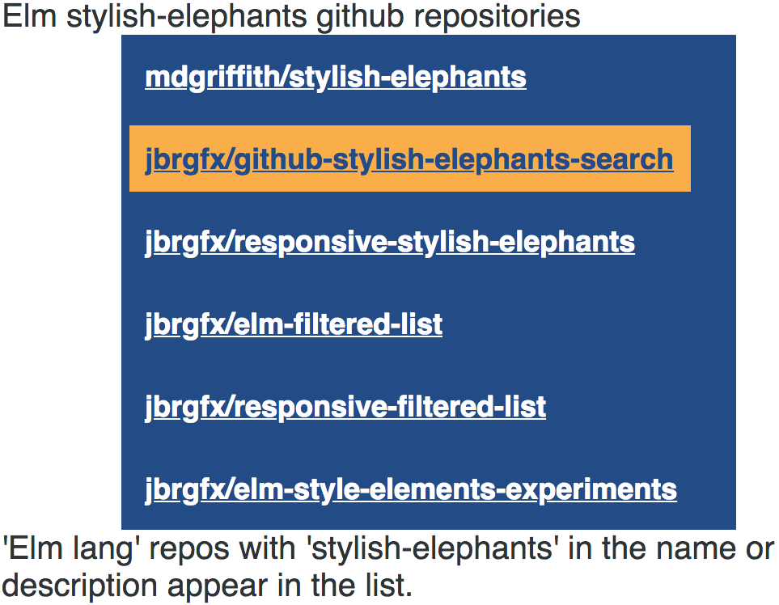

# Elm list of stylish-elephants repos
Github repos having "stylish-elephants" in the project name or the project description.

# Demo
[github-stylish-elephants-search](https://jbrgfx.github.io/github-stylish-elephants-search/)

Originally Part 14 of [rtfeldman's workshop](https://github.com/rtfeldman/elm-workshop/tree/master/part14)
Refactored using stylish-elephants

=======

## Getting Started

You need Elm 0.18 installed

## Installation

clone this repo
and then from the project's root:

```bash
elm-package install
```

## Create a Github AuthN token
See Richard Feldman's [workshop README](https://github.com/rtfeldman/elm-workshop) for instructions
Do not commit the token to github or another version control system.

## Building will fail until you create Auth.elm as described above

```bash
elm-make Main.elm --output=elm.js
```

## Open the root folder's index.html file in a browser

You will see:


